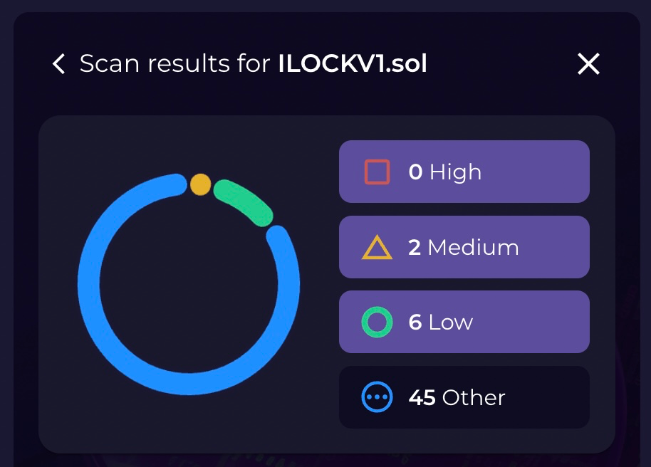
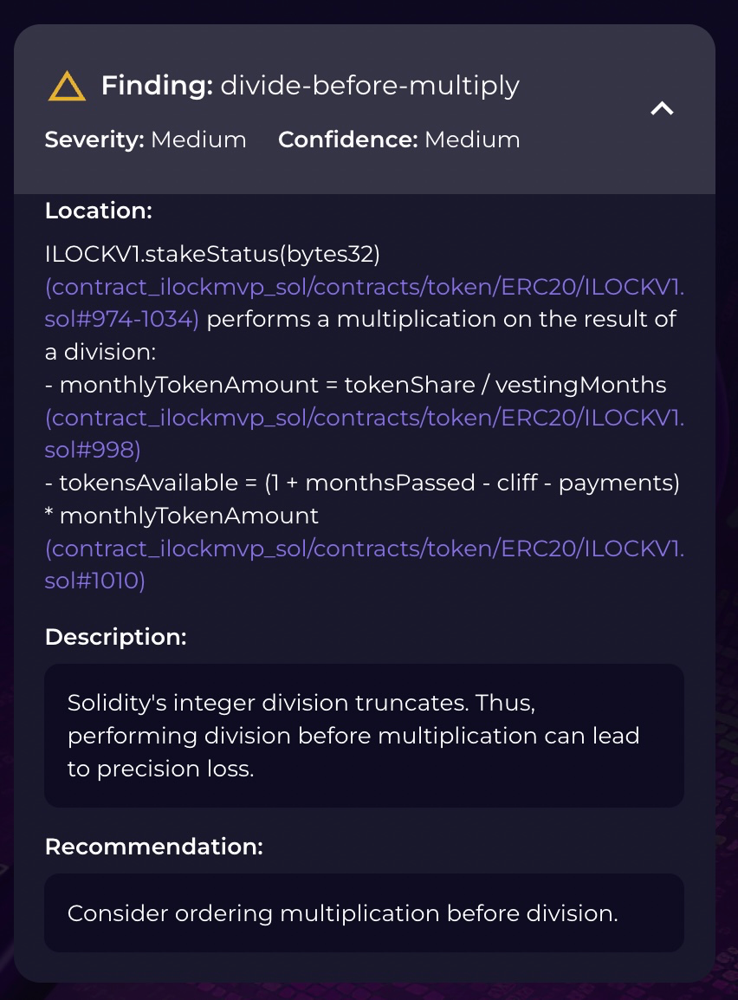
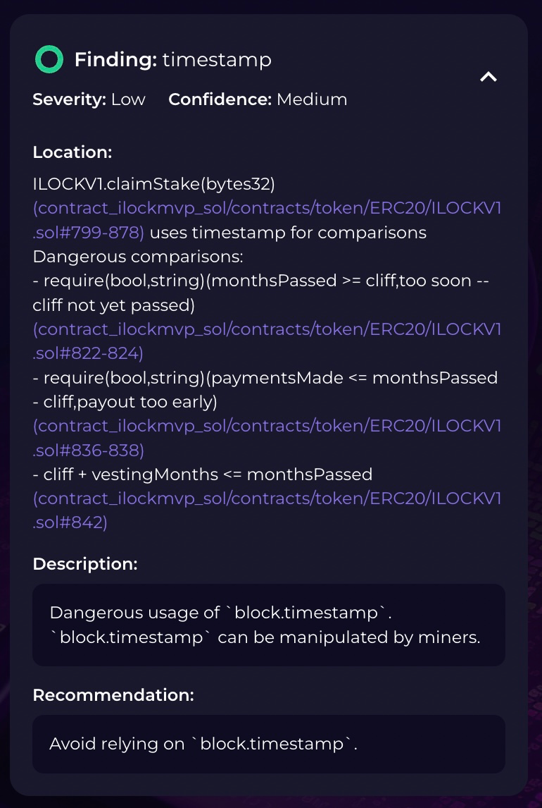
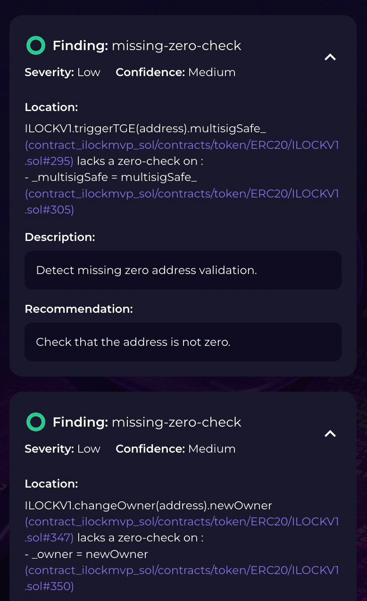

# Audit Wizard ILOCKmvp Solidity Contract Audit

This report involves an internal self-audit on the ILOCK solidity contract originally intended for Aribrum One Mainnet.

The tool used in this internal audit is [Audit Wizard](https://www.auditwizard.io).

This report outlines findings, refutations, and conclusions determined by the process of reviewing for and addressing issues in the contract.

## Initial Scan:

Contract initial condition, commit: [600754e59986d3bef3c3b87b2ddc8f144bf193bc](https://github.com/interlock-network/interlock-smartcontracts/commit/600754e59986d3bef3c3b87b2ddc8f144bf193bc).

Initially there was one valid high severety finding, and two invalid. The valid finding was an upgradeable storage field withing the `UpgradeableContext.sol` file that conflicted with the `ILOCKV1.sol` `__gap` field. To address this, the `__gap` was removed from `UpgradeableContext.sol`. This as per commit: [1010f048a3606bef6ba8d57787d04b8038d03ae7](https://github.com/interlock-network/interlock-smartcontracts/commit/1010f048a3606bef6ba8d57787d04b8038d03ae7).

The invalid findings were statements that the contract initializer is not protected. This is not true, and attempts to reinitialize the contract after deployment consistently fail. These are the invalid high-severity findings:


These findings were caused by the [Slitherin Detectors](https://github.com/pessimistic-io/slitherin/). The next scan (with the Slitherin Detectors turned off) omitted th erroneous findings.

## Second Scan:



### The two medium-severity findings concern arithmetic safety:




Solidity's integer division is [floor division](https://docs.soliditylang.org/en/v0.8.21/types.html#division), meaning it rounds toward zero. In the case of `ILOCKVx`, this is a non-issue because the rounding error is accounted for in the final month of token distribution. If there is any token left due to rounding, this modulo is added to the final month's payment, see:

```solidity
        // if at final payment, add remainder of share to final payment
        if (tokenShare - tokensPaidOut - tokensAvailable < monthlyTokenAmount && tokensAvailable > 0) {
            
            tokensAvailable += tokenShare % vestingMonths; }
```
and
```solidity
        // if at final payment, add remainder of share to final payment
        if (tokensRemaining - thisPayout < monthlyTokenAmount) {
            
            thisPayout += tokenShare % vestingMonths; }
```
These two medium-severity findings are disregarded.

**NOTE:** _Actually_, these two medium severity findings were resolved when enforving ^0.8.18 solidity compiler.

### The remaining findings are low-severity:


#### We can disregard the timestamp findings:



The use of `block.timestamp` in the `ILOCKVx` token contract is insensitive to the risk of miners manipulating the timestamp. The worst that a malicious miner could accomplish in manipulating the timestamp is issue that month's payout early for a stakeholder. Due to the nature of how payout time calculated, a malicious miner would need to manipulate the block timestamp by 30 days to get an _extra_ payout ahead of schedule, which is simply impossible.

#### We can address the zero address findings:



We add the `noZero()` modifier to `changeOwner` and `triggerTGE` functions to resolve these two low-severity findings, per commit: [497ab1171d5c8d7819a043206fd1e3e7a05724eb](https://github.com/interlock-network/interlock-smartcontracts/commit/497ab1171d5c8d7819a043206fd1e3e7a05724eb).

## Informational findings:

The informational findings break down into categories:

- assembly
- pragma
- dead-code
- solc-version
- low-level-calls
- naming-convention
- redundant-statements
- similar-names

**solc-version:** Findings were resolved by upgrading the solidity compiler to ^0.8.18 for all files in contract tree, commit: [89a44b3c5e3ad7956083257ba9a543a9f2ec1625](https://github.com/interlock-network/interlock-smartcontracts/commit/89a44b3c5e3ad7956083257ba9a543a9f2ec1625).

**dead-code, low-level-calls, assembly:** These findings stem from `ContextUpgradeable.sol`, `AddressUpgradeable.sol`, and `initializeable.sol`. The dead code is left intact because there may be larger reasons for Open Zeppelin implementing these functionalities, and likewise the low level calls and assembly are left intact. We are to trust that Open Zeppelin's code is secure.

**naming-convention:** Atypical variable names resolved, commit: [788be0c9463bac3953a1b892e7233f0c6647ad55](https://github.com/interlock-network/interlock-smartcontracts/commit/788be0c9463bac3953a1b892e7233f0c6647ad55).

## AI Analysis:

The `claimStake()` and `getStake()` function may be difficult to understand. Here is the Audit Wizard autogenerated overview of these two functions.

**claimStake():**

_The claimStake function in the contract is responsible for releasing the tokens to stakeholders based on the vesting schedule. Here's how it works:_

_1 - It first checks if the current time has passed the next payout time by calling the _checkTime function. If the current time has passed the next payout time, it updates the nextPayout and monthsPassed variables._

_2 - It then checks if the stake exists and retrieves the stake details._

_3 - It checks if the monthsPassed is greater than or equal to the cliff period and if the tokens paid out so far is less than the total token share of the stake. If not, it reverts the transaction._

_4 - It calculates the monthly token amount by dividing the total token share by the number of vesting months._

_5 - It calculates the number of payments made so far by dividing the tokens paid out by the monthly token amount._

_6 - It then calculates the number of payments to be made in this claim. If the monthsPassed is greater than or equal to the sum of the cliff and vesting months, it pays out all remaining payments. Otherwise, it pays out the payments for the months passed since the last claim._

_7 - It calculates the total payout amount by multiplying the number of payments to be made by the monthly token amount. If this is the final payment, it adds any remaining tokens to the payout._

_8 - It then transfers the payout amount from the pool to the stakeholder, updates the paid amount in the stake, and updates the total supply of tokens._

_9 - Finally, it emits a StakeClaimed event._

_The function seems to correctly calculate the release time and payment amount based on the vesting schedule and the time passed. However, it's important to note that the actual behavior of the contract can depend on how it's used and the specific parameters of each stake._

**stakeStatus():**

The stakeStatus function provides information about a specific stake, including the total token share, tokens paid out, tokens remaining, tokens available for claim, monthly token amount, vesting months, and cliff period. Here's how it works:

_1 - It checks if the stake exists and retrieves the stake details._

_2 - It calculates the monthly token amount by dividing the total token share by the number of vesting months._

_3 - It calculates the number of payments made so far by dividing the tokens paid out by the monthly token amount._

_4 - It calculates the remaining tokens by subtracting the tokens paid out from the total token share._

_5 - It calculates the tokens available for claim. If the monthsPassed is within the vesting period (greater than or equal to the cliff and less than the sum of the cliff and vesting months), it calculates the tokens available as the payments for the months passed since the last claim times the monthly token amount. If the monthsPassed is less than the cliff, no tokens are available. If the monthsPassed is greater than or equal to the sum of the cliff and vesting months, all remaining tokens are available._

_6 - If this is the final payment and tokens are available, it adds any remaining tokens to the tokens available._

_7 - It returns the total token share, tokens paid out, tokens remaining, tokens available, monthly token amount, vesting months, and cliff period._

_The function seems to correctly calculate the release time and payment amount based on the vesting schedule and the time passed. However, it's important to note that the actual behavior of the contract can depend on how it's used and the specific parameters of each stake._
